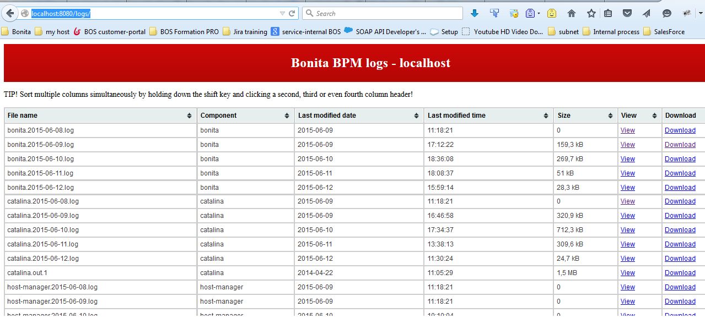

# bonitasoft-app-logWebInterface
Webapp to read and download log file of the Bonitasoft plateform

This app will enable tech user to get the container logs without using a file system access 

#Configure : remove dev files
* Remove dev context files : webapp/logs/META-INF/context.dev.xml and web.dev.xml
* Edit the authorized user/password in webapp/logs/META-INF/users.xml
* Edit the context.xml
* Edit the param-value of the logsDirectory context-param to point to your container log folder

#Deploy
* Copy the webapp/logs folder into your container folder

#Use
* Go to http://localhost:8080/logs/ and log you in with the users.xml credential

# GUI example
